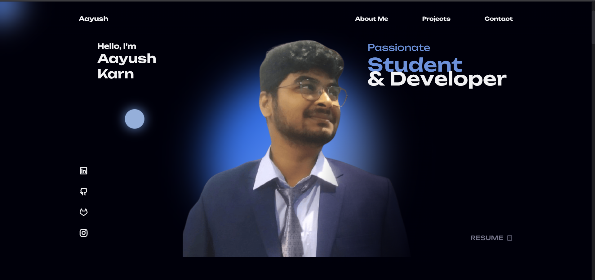

# Aayush Karn – Portfolio Website

This is my personal **portfolio website**, built to showcase my skills, projects, and achievements as a **B.Sc. IT student** at **Techspire College, Kathmandu**. The website highlights my work in web development, programming, and design, along with links to my social profiles and downloadable CV.

---

## Preview

---

## Technologies Used

- **HTML5** – Structure and layout  
- **CSS3** – Styling and responsive design  
- **JavaScript (ES6)** – Interactivity and animations  
- **Swiper.js** – Carousel and slider functionality  
- **ScrollReveal.js** – Smooth scroll animations

---

## Project Structure
├── index.html
├── preview.png
├── assets/
│ ├── css/
│ │ ├── styles.css
│ │ └── swiper-bundle.min.css
│ ├── js/
│ │ ├── main.js
│ │ ├── scrollreveal.min.js
│ │ └── swiper-bundle.min.js
│ ├── img/
│ │ └── (all images used in the site)
│ └── pdf/
│ └── Aayush cv.pdf
└── README.md
